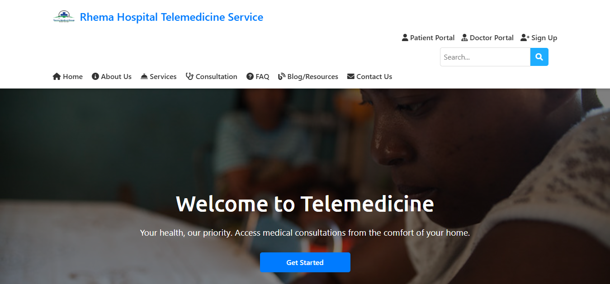
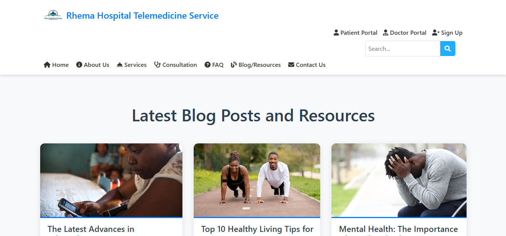
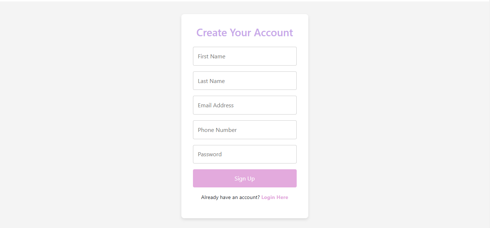

# Telemedicine Web Application

## Overview

The **Telemedicine Web Application** simplifies healthcare access by enabling users to register as patients, book consultations, and contact administrators. It integrates a MySQL database for storing user data, consultation bookings, and inquiries. The platform includes static frontend pages for an engaging user experience and a dynamic backend for functionality.

---

## Features

The Telemedicine Web Application provides the following features:

1. **Landing Page**:

   - Introduces the platform's purpose and benefits.
   - Displays a hero section with platform highlights.
   - Provides call-to-action buttons for patient registration and consultation booking.

2. **About Page**:

   - Offers an overview of the telemedicine platform.
   - Explains the platform’s mission and benefits for patients.

3. **Services Page**:

   - Lists specialties and services offered, including cardiology, dermatology, pediatrics, and more.

4. **Contact Page**:

   - Features a form where users can submit inquiries or feedback.

5. **Patient Registration Page**:

   - Allows users to register as patients by entering their details:
     - First Name
     - Last Name
     - Email
     - Phone Number
     - Password

6. **Consultation Booking Form**:

   - Enables patients to book appointments by:
     - Selecting a medical specialty.
     - Choosing a doctor dynamically based on the specialty.
     - Setting a preferred appointment date and time.

7. **Backend API**:
   - Handles functionalities such as:
     - Patient registration.
     - Consultation bookings.
     - Contact form submissions.

---

## Project Structure

```plaintext
The project directory structure is organized as follows:
project-root/
├── db.js # MySQL database connection
├── routes/ # Backend route handlers
│ ├── patientRoutes.js # Handles patient registration
│ ├── providerRoutes.js # Handles provider registration
│ ├── adminRoutes.js # Handles admin registration
│ ├── consultation.js # Handles consultation form submissions
│ └── contact.js # Handles contact form submissions
├── controllers/ # Backend controllers
│ ├── patientController.js # Logic for patient registration
│ ├── providerController.js # Logic for provider registration
│ └── adminController.js # Logic for admin registration
├── public/ # Frontend assets
│ ├── index.html # Landing page
│ ├── about.html # About page
│ ├── services.html # Services page
│ ├── contact.html # Contact page
│ ├── registration.html # Patient registration page
│ ├── consultation.html # Consultation booking page
│ ├── css/ # CSS files for styling
│ │ └── styles.css # Main stylesheet
│ ├── images/ # CSS files for styling
│ │ └── styles.css # Main stylesheet
│ ├── script/ # JavaScript files for frontend functionality
│ │ ├── register.js # Interactivity for consultation form
│ │ ├── script.js # Interactivity for contact form
├── app.js # Main server file
├── package.json # Project dependencies and metadata
└── README.md # Project documentation
```

# Project documentation

## Installation Instructions

To set up and run this project locally, follow these steps:

1. **Clone the Repository**:

   ```bash
   git clone https://github.com/ATOROYO/Backend-Development-For-Telemedicine.git
   cd telemedicine
   ```

2. **Install Dependencies**:

   ```bash
   npm install
   ```

3. **Configure the Database**:

   - Ensure MySQL is installed and running.
   - Create a database named telemedicine_db.
   - Use the SQL script below to create required tables:

4. **Update Database Connection**: Open the db.js file and configure the MySQL connection details:

   ```javascript
   const pool = mysql.createPool({
     host: 'localhost',
     user: 'your-username',
     password: 'your-password',
     database: 'telemedicine_db',
   });
   ```

5. **Start the Server**: Run the following command to start the Node.js server:

   ```bash
   node app.js
   ```

6. **Access the Application**: Open a web browser and navigate to http://localhost:3000 to access the application.

## API Endpoints

The backend provides the following endpoints:

### Patient Registration

**1. Endpoint:** POST /patients/register

- Accepts user details (first name, last name, email, phone, and password) and registers a new patient.

**Request Body:**

```json
{
  "firstName": "John",
  "lastName": "Doe",
  "email": "[email address removed]",
  "phone": "123-456-7890",
  "password": "password123"
}
```

### Consultation Booking

**2. Endpoint:** POST /consultation/book

- Accepts consultation details (name, email, phone, specialty, doctor, appointment date, and time) and saves the booking.

**Request Body:**

```json
{
  "name": "Jane Smith",
  "email": "[email address removed]",
  "phone": "987-654-3210",
  "specialty": "Cardiology",
  "doctor": "Dr. Johnson",
  "appointmentDate": "2023-11-30",
  "appointmentTime": "10:00 AM"
}
```

### Contact Form Submission

**3. Endpoint:** POST /contact/submit

- Accepts contact form data (name, email, subject, and message) and stores it in the database.

**Request Body:**

```json
{
  "name": "Alice Johnson",
  "email": "[email address removed]",
  "subject": "Inquiry",
  "message": "This is a test message."
}
```

## Frontend Pages

The frontend includes the following pages:

### index.html:

- The homepage introducing the platform with an engaging UI.

### about.html:

- A page providing detailed information about the platform.

### services.html:

- Displays the specialties and services offered by the platform.

### contact.html:

- A page with a form for users to contact the platform administrators.

### registration.html:

- A form for patients to register their accounts.

### consultation.html:

- A form for booking a consultatio

## Technology Stack

### Frontend

- HTML5
- CSS3
- JavaScript

### Backend

- Node.js with Express.js
- MySQL for database management
- mysql2 for database interaction

## Future Enhancements

### Authentication:

- Implement user login with session management.

### Admin Panel:

- Provide admin access to view, approve, or modify patient bookings and contact inquiries.

### Telemedicine Features:

- Add video call and prescription management functionality to the application.

### Notifications:

- Send email notifications for successful bookings or contact submissions.

## Screeshots

Below 👇🏽 is the home page of the Telemedicine Application


Below 👇🏽 is the Blog page with resources to help the patients with health tips


Below 👇🏽 is the signup page for the Telemedicine for new Users


## Conclusion

```vbnet
Let me know if there’s anything else to add!
```

## Contact

If you have any questions, feedback, or suggestions, feel free to reach out to me:

- **Email:** [davidatoroyosika@gmail.com](mailto:davidatoroyosika@gmail.com)

```

```
